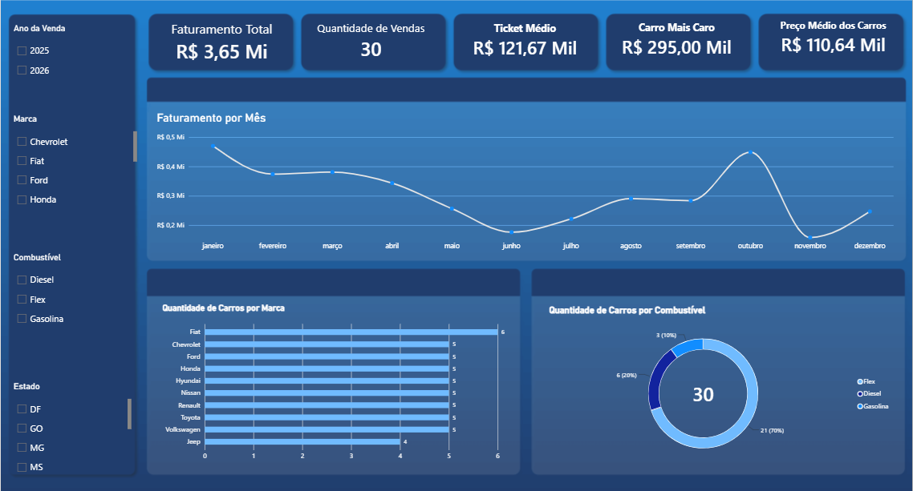

# Análise de Vendas de Veículos

Projeto desenvolvido para analisar dados de vendas de veículos utilizando **MySQL**, **SQL** e **Power BI**.

## Objetivo

Transformar dados de vendas em informações visuais que auxiliem na análise do faturamento, quantidade de vendas, preços e características dos veículos comercializados.

## Indicadores

* Faturamento total
* Quantidade de vendas
* Ticket médio
* Carro mais caro
* Preço médio dos carros

## Visualizações

* Faturamento por mês
* Quantidade de carros por marca
* Quantidade de carros por combustível
* Filtros por ano, marca, combustível e estado

## Tecnologias utilizadas

* MySQL
* MySQL Workbench
* SQL
* Power BI Desktop
* DAX

## Arquivos do projeto

* `01_banco_e_dados.sql`: criação do banco, tabelas e inserção dos dados.
* `02_analises.sql`: consultas SQL utilizadas nas análises.
* `analise_veiculos.sql`: backup completo do banco de dados.
* `Dashboard_Vendas.pbix`: dashboard interativo desenvolvido no Power BI.
* `dashboard.png`: imagem de apresentação do dashboard.

## Como executar

1. Importe o arquivo `analise_veiculos.sql` no MySQL Workbench.
2. Abra o arquivo `Dashboard_Vendas.pbix` no Power BI Desktop.
3. Configure a conexão com o banco MySQL.
4. Informe o servidor, o usuário e a senha do seu MySQL.
5. Atualize os dados do dashboard.

## Autor

Desenvolvido por Diego Costa.
